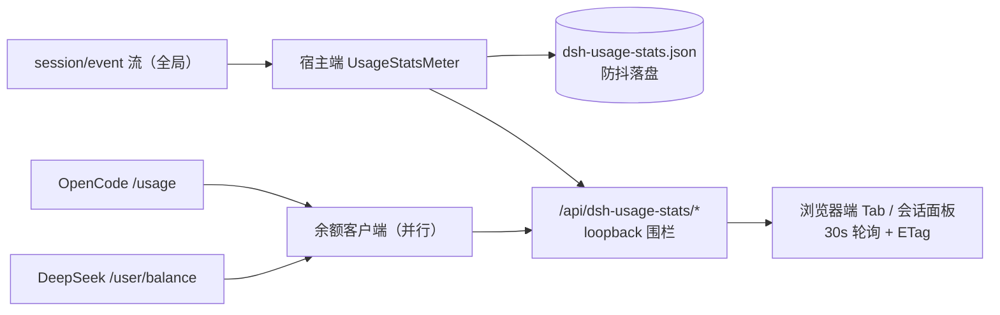

# @abcdefu_cja/dsh-usage-stats

[](https://www.npmjs.com/package/@abcdefu_cja/dsh-usage-stats)
[](./LICENSE)
[](https://github.com/jianweideng0515-create/dsh-usage-stats/actions)

DSH Web 的 API 用量统计插件：精确统计 token、请求、轮次、缓存命中率与费用，同时监控 OpenCode 订阅配额与 DeepSeek 官方余额。装完即用，无需任何配置。

| | |
|---|---|
| **精确计量** | 直接读取 provider `usage` 报告，采用 DSH 的 `(turn, step)` 替换语义——非启发式估算 |
| **独立插件** | 不属于 dsh-web-ui 家族，经官方 `settings.section` 槽挂载为设置页专属 Tab |
| **多提供商余额** | OpenCode 配额与 DeepSeek 余额并行快照，各自失败互不影响 |

## 目录

- [功能特性](#功能特性)
- [截图](#截图)
- [安装](#安装)
- [配置](#配置)
- [余额自动检测](#余额自动检测)
- [架构](#架构)
- [开发](#开发)
- [已知限制](#已知限制)
- [许可](#许可)

## 功能特性

**用量概览 Tab**

- 常驻 KPI：Token 总量（含费用）、请求数、完成轮次、活跃天数、缓存命中率、提供商动态卡
- Token 四分色拆分条（输入 / 缓存读 / 缓存写 / 输出）
- 堆叠柱状趋势图：按模型分段着色，Y 轴中文刻度（万/亿），悬停查看当日明细；可切换 费用 / 请求数 指标
- 模型明细表 + 最贵会话排行（费用降序 Top 10）
- 一键导出当前范围的按日 × 分模型明细 CSV（Excel 直接打开）

**模型与缓存 Tab**

- 模型占比 Donut 图 + 缓存效率诊断（命中率、节省 token、节省比例）

**余额与配额 Tab**

- OpenCode 订阅配额三窗口进度条（滚动 / 每周 / 每月 + 重置倒计时）
- DeepSeek 官方余额（金额 / 预计可用天数 / 充值页跳转 / 手动刷新）

**其他**

- 会话用量面板：会话页按钮展开当前会话实时消耗
- 日费用阈值提醒：今日费用超过 `alertDailyCost` 时顶部常驻横幅
- 7 / 14 / 30 / 90 天与自定义范围；30s 轮询（ETag 条件请求，未变化 304 短路）

## 截图

### 用量概览


### 模型与缓存


### 余额与配额


### 会话用量面板


## 安装

### npm（推荐）

```sh
npm i @abcdefu_cja/dsh-usage-stats
dsh plugin --profile web add @abcdefu_cja/dsh-usage-stats
```

### GitHub 克隆 / 本地开发

```sh
git clone https://github.com/jianweideng0515-create/dsh-usage-stats
dsh plugin --profile web add link:/path/to/dsh-usage-stats
```

安装后重启 `dsh web`，设置页左侧导航出现「用量统计」入口：


### 配置文件方式（可选）

也可写入个人 DSH 覆盖层 `~/.dsh/config.yaml`（保存即热加载）：

```yaml
- insert:
    - id: usage-stats
      name: '@abcdefu_cja/dsh-usage-stats'
      config:
        enabled: true
        currency: CNY
        balance:
          mode: auto
          refreshMs: 600000
```

所有配置项均可选，默认值见下表。

## 配置

| Key | 类型 | 默认 | 含义 |
|---|---|---|---|
| `enabled` | `boolean` | `true` | 总开关 |
| `currency` | `string` | `CNY` | 费用与余额的显示货币（¥ / $） |
| `alertDailyCost` | `number` | 关 | 日费用阈值：今日费用达到该值时页面顶部渲染超限横幅 |
| `prices` | `Record<string, ModelPrice>` | 内置 DeepSeek 价目 | 每百万 token 单价，按模型键覆盖内置表 |
| `defaultPrice` | `ModelPrice` | 无（按 0 计） | 未在 `prices` 中的模型的兜底单价 |
| `balance.mode` | `'auto' \| 'manual' \| 'off'` | `auto` | `auto` 自动检测已知 provider；`manual` 固定端点；`off` 关闭 |
| `balance.baseUrl` | `string` | 无 | 余额端点基址（`manual` 必填） |
| `balance.path` | `string` | `/user/balance` | 追加到基址的路径 |
| `balance.apiKeyEnv` | `string` | `DEEPSEEK_API_KEY` | 存放 API key 的环境变量名 |
| `balance.refreshMs` | `number` | `600000` | 余额刷新间隔（毫秒，最小 1000） |

`ModelPrice` 为 `{ input, cacheRead, cacheWrite, output }`（每百万 token，非负数）。内置 DeepSeek 价目：

| 模型 | input | cacheRead | cacheWrite | output |
|---|---|---|---|---|
| `deepseek-chat` | 2 | 0.5 | 2 | 8 |
| `deepseek-reasoner` | 4 | 1 | 4 | 16 |

## 余额自动检测

`auto` 模式同时检测以下 provider（端点内置，profile 无 baseURL 也可推断）：

| provider | 端点 | key 环境变量 | 展示 |
|---|---|---|---|
| OpenCode Go | `GET opencode.ai/zen/go/v1/usage` | `OPENCODE_GO_API_KEY` | 订阅配额三窗口 |
| DeepSeek | `GET api.deepseek.com/user/balance` | `DEEPSEEK_API_KEY` | 金额余额 + 预计可用天数 |

key 优先进程环境变量，其次 `~/.dsh/.credentials.yaml`。

## 架构



- **宿主端**：订阅 `session/event`（全局），把每次请求折入 `UsageStatsMeter`，按日（本地时区）与分模型桶聚合。落盘原子写（`tmp + rename`，损坏转 `.bak` 重建）；余额客户端并行拉取全部已检测 provider，各自失败互不影响。
- **浏览器端**：设置页左侧导航独立 Tab（`settings.section` 槽）+ 会话页用量按钮（`conversation.session.header.utilities` 槽）。
- **对模型透明**：不注入提示片段、不注册工具，每请求零额外 token，无 KV 缓存影响。
- **导出形态**：`inject` / `Config` / `apply`，无默认导出；计量、计价、存储、查询与 provider 检测均为纯函数并有单元测试。

## 开发

```sh
pnpm install
pnpm build    # tsc -b && tsdown（宿主 ESM + 浏览器闭包工厂 bundle）
pnpm test     # vitest：宿主纯函数单测 + jsdom 组件测试
```

源码结构：

```
src/
├─ index.ts           # 装配：事件订阅 / 落盘 / 路由注册 / 余额定时器
├─ meter.ts           # 计量状态机（token / 请求 / 轮次 / 费用）
├─ query.ts           # 区间聚合（补零时间轴）
├─ pricing.ts         # 价目表计费
├─ balance.ts         # 多 provider 快照客户端
├─ provider-detect.ts # 端点自动检测
├─ routes.ts          # 只读 HTTP 路由（loopback 围栏）
├─ store.ts           # 原子落盘
└─ client/            # 浏览器端（卡片 / 图表 / 会话面板 / 设置）
```

## 已知限制

- **费用是估算**：按价目表 × provider 上报用量计算，非账单方发票；请以实际账单为准。
- **余额取决于 provider 端点**：DeepSeek 余额要求有效官方 key（OpenCode 的 key 不通用）；OpenCode 配额接口可能受 Cloudflare 延迟惩罚（已用浏览器 UA + 25s 超时缓解）。
- **历史自启用时起算**：启用前的使用不回填。
- **留存**：按日数据保留 730 天，会话保留最近 500 个。

## 许可

BSD-3-Clause，见 [LICENSE](./LICENSE)。
