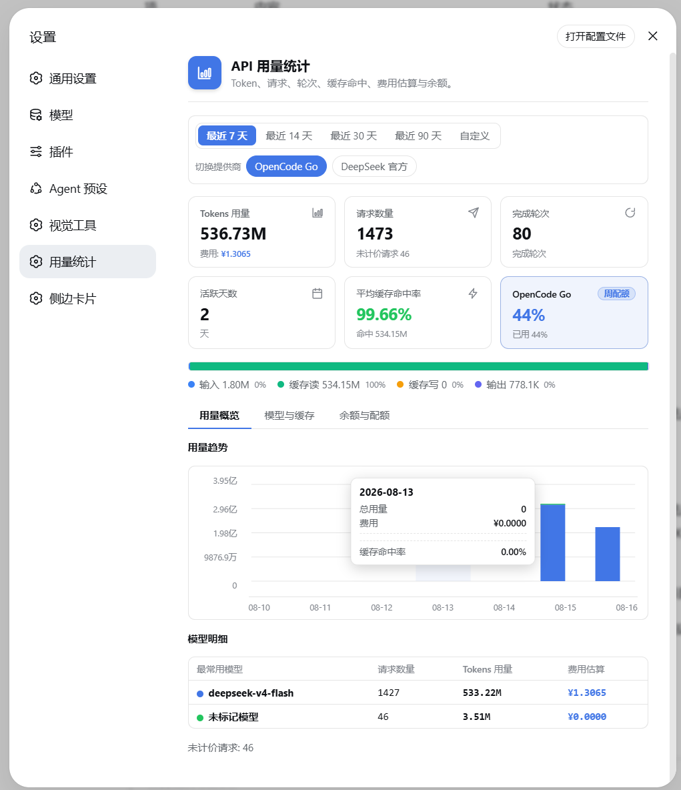
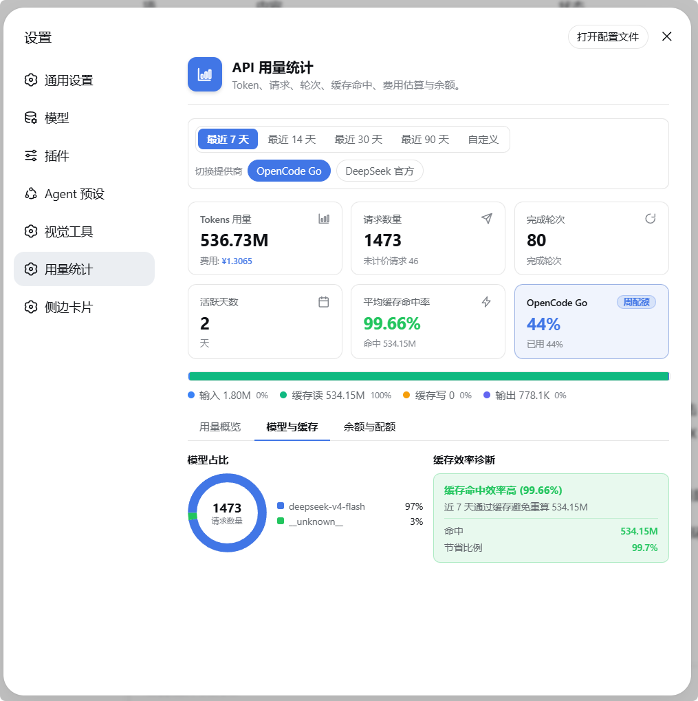
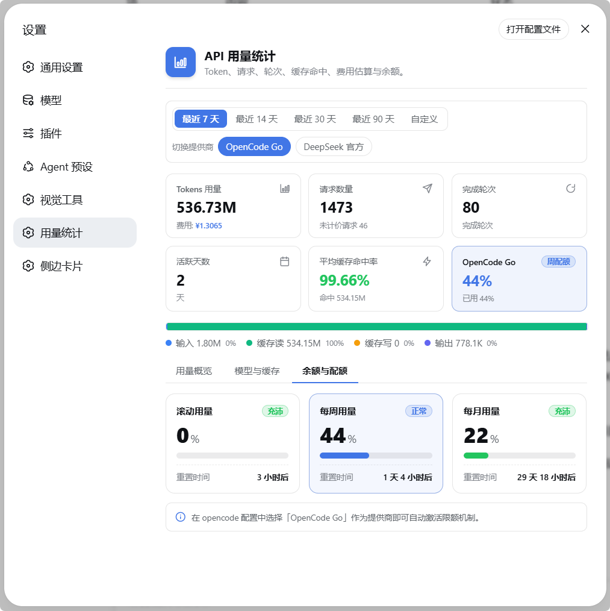
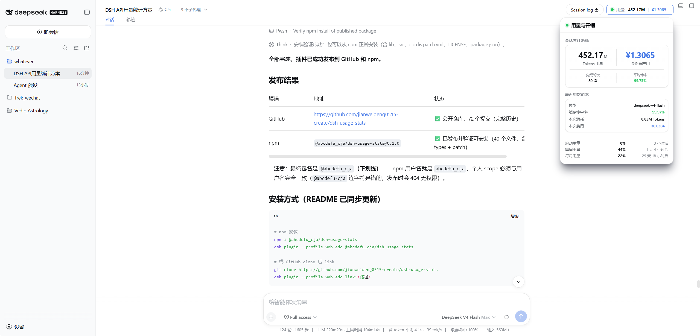
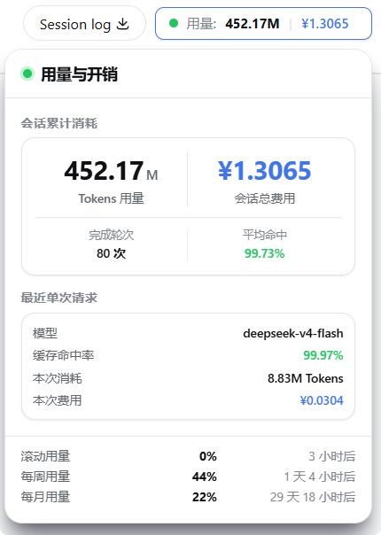

# @abcdefu_cja/dsh-usage-stats

[](https://www.npmjs.com/package/@abcdefu_cja/dsh-usage-stats)
[](./LICENSE)
[](https://github.com/jianweideng0515-create/dsh-usage-stats)

DSH Web 的 API 用量统计插件：精确统计 token、请求、轮次、活跃天数、缓存命中率与费用，并同时监控 OpenCode 订阅配额与 DeepSeek 官方余额。

- **精确计量**：直接读取 provider `usage` 报告（`inputTokens` / `outputTokens` / `cacheReadTokens` / `cacheWriteTokens`），采用 DSH 自身的 `(turn, step)` 替换语义，最终消息替换先前用量块而不重复累计——非启发式估算
- **独立插件**：不属于 dsh-web-ui 家族，经官方 `settings.section` 槽挂载为设置页左侧导航专属 Tab
- **多提供商快照**：OpenCode 配额与 DeepSeek 余额并行拉取、各自失败互不影响

## 目录

- [功能特性](#功能特性)
- [截图](#截图)
- [安装](#安装)
- [配置](#配置)
- [余额自动检测](#余额自动检测)
- [架构](#架构)
- [开发](#开发)
- [已知限制](#已知限制)
- [许可](#许可)

## 功能特性

- **用量概览 Tab**
  - 常驻 KPI 区：Token 总量（含费用）、请求数、完成轮次、活跃天数、平均缓存命中率、提供商动态卡（OpenCode 周配额 / DeepSeek 余额）
  - Token 四分色拆分条（输入 / 缓存读 / 缓存写 / 输出）
  - 堆叠柱状趋势图：按模型分段着色，Y 轴中文单位刻度（万/亿），悬停柱子显示当日明细（总用量 / 费用 / 分模型 Top5+其他 / 缓存命中率）
  - 模型明细表（请求数 / token / 费用）
- **模型与缓存 Tab**：模型占比 Donut 图 + 缓存效率诊断（命中率、节省 token、节省比例）
- **余额与配额 Tab**：OpenCode 订阅配额三窗口进度条（滚动 / 每周 / 每月 + 重置倒计时）；DeepSeek 官方余额（金额 / 预计可用天数 / 充值页跳转 / 手动刷新）
- **会话用量面板**：会话页按钮展开当前会话用量（累计 / 最近请求 / 进行中轮次实时消耗）
- **数据导出**：一键下载当前范围的按日 × 分模型明细 CSV（UTF-8 BOM，Excel 直接打开）
- **最贵会话排行**：按费用降序 Top 10，快速定位异常消耗
- **日费用阈值提醒**：配置 `alertDailyCost` 后，今日费用超限即在用量页顶部常驻横幅提示
- 7 / 14 / 30 / 90 天与自定义范围切换，展开时 30s 轮询（ETag 条件请求，未变化 304 短路）

## 截图

### 用量概览



### 模型与缓存



### 余额与配额



### 会话用量面板



## 安装

### npm（推荐）

```sh
npm i @abcdefu_cja/dsh-usage-stats
dsh plugin --profile web add @abcdefu_cja/dsh-usage-stats
```

### GitHub 克隆 / 本地开发

```sh
git clone https://github.com/jianweideng0515-create/dsh-usage-stats
dsh plugin --profile web add link:/path/to/dsh-usage-stats
```

安装后重启 `dsh web`，设置页左侧导航出现「用量统计」入口：



### 配置文件方式（可选）

也可写入个人 DSH 覆盖层 `~/.dsh/config.yaml`（保存即热加载）：

```yaml
- insert:
    - id: usage-stats
      name: '@abcdefu_cja/dsh-usage-stats'
      config:
        enabled: true
        currency: CNY
        balance:
          mode: auto
          refreshMs: 600000
```

所有配置项均可选，默认值见下表。

## 配置

| Key | 类型 | 默认 | 含义 |
|---|---|---|---|
| `enabled` | `boolean` | `true` | 总开关；关闭后停止事件订阅、落盘与计量 |
| `prices` | `Record<string, ModelPrice>` | 内置 DeepSeek 价目表 | 每百万 token 单价，按模型键（`input` / `cacheRead` / `cacheWrite` / `output`）；用户项覆盖内置表 |
| `defaultPrice` | `ModelPrice` | 无 | 未在 `prices` 中的模型的兜底单价；缺省时未知模型按 0 计价 |
| `currency` | `string` | `CNY` | 费用与余额的显示货币（CNY 显示 ¥，USD 显示 $） |
| `alertDailyCost` | `number` | 无 | 日费用阈值：今日费用达到该值时，用量页顶部渲染超限横幅；未配置关闭 |
| `balance.mode` | `'auto' \| 'manual' \| 'off'` | `auto` | `auto` 自动检测全部已知 provider（OpenCode 配额 + DeepSeek 余额）；`manual` 使用固定 `baseUrl`；`off` 关闭余额拉取 |
| `balance.baseUrl` | `string` | 无 | 余额端点基址（`manual` 模式必填） |
| `balance.path` | `string` | `/user/balance` | 追加到 `baseUrl` 的余额路径 |
| `balance.apiKeyEnv` | `string` | `DEEPSEEK_API_KEY` | 存放 provider API key 的环境变量名（优先进程环境变量，其次 `~/.dsh/.credentials.yaml`） |
| `balance.refreshMs` | `number` | `600000` | 余额刷新间隔（毫秒，最小 1000） |

`ModelPrice` 为 `{ input, cacheRead, cacheWrite, output }`，非负数。内置 DeepSeek 价目：

| 模型 | input | cacheRead | cacheWrite | output |
|---|---|---|---|---|
| `deepseek-chat` | 2 | 0.5 | 2 | 8 |
| `deepseek-reasoner` | 4 | 1 | 4 | 16 |

（每百万 token，CNY）

## 余额自动检测

`auto` 模式同时检测以下 provider（内置端点表，profile 无 baseURL 也可推断）：

| provider | 端点 | 展示 |
|---|---|---|
| OpenCode Go（`opencode-go`） | `GET https://opencode.ai/zen/go/v1/usage`，key 环境变量 `OPENCODE_GO_API_KEY` | 订阅配额三窗口（滚动 / 每周 / 每月） |
| DeepSeek（`deepseek`） | `GET https://api.deepseek.com/user/balance`，key 环境变量 `DEEPSEEK_API_KEY` | 金额余额 + 预计可用天数 |

## 架构

```
session/event 流（全局）
      │
      ▼
宿主端 UsageStatsMeter ──► 按日 / 分模型桶 ──► ~/.dsh/dsh-usage-stats.json（防抖落盘）
      │
      ▼
只读 HTTP 路由 /api/dsh-usage-stats/*（loopback 围栏）──► 浏览器端 Tab / 会话面板（30s 轮询）
      │
      ▼
余额客户端（并行）：OpenCode /v1/usage 配额 + DeepSeek /user/balance 金额
```

- **宿主端**：订阅 `session/event`（全局、所有会话），把每次请求折入 `UsageStatsMeter`（token / 请求 / 轮次 / 费用 / 最近请求元数据）。按日（本地时区 `YYYY-MM-DD`）与分模型桶聚合，落盘 `~/.dsh/dsh-usage-stats.json`（30s 防抖 + flush/dispose 即时写，原子 `tmp + rename`，损坏文件转 `.bak` 重建）。余额客户端并行拉取全部已检测 provider 的快照，各自失败互不影响。
- **浏览器端**：注册设置页左侧导航独立 Tab（官方 `settings.section` 槽，id `usage-stats`）与会话页用量按钮（`conversation.session.header.utilities` 槽）。

插件为函数/命名空间形态：`inject` / `Config` / `apply`，无默认导出。宿主端另导出 `USAGE_STATS_METER_KEY`（挂到上下文的 meter symbol）与 `USAGE_STATS_SETTINGS_NAMESPACE`。计量、计价、存储、查询与 provider 检测模块均为纯函数并有单元测试。

对模型透明：不注入任何提示片段、不注册任何工具，每请求零额外 token，无 KV 缓存稳定性影响。

## 开发

```sh
pnpm install
pnpm build    # tsc -b && tsdown（宿主 ESM + 浏览器闭包工厂 bundle）
pnpm test     # vitest：宿主纯函数单测 + jsdom 组件测试
```

## 已知限制

- **费用是估算**：按内置或用户价目表 × provider 上报用量计算，非账单方发票；请以实际账单为准。
- **余额取决于 provider 端点**：DeepSeek 官方余额接口要求有效官方 key（OpenCode 的 key 不被接受）；OpenCode 配额接口可能受 Cloudflare 对非浏览器 UA 的延迟惩罚（已用浏览器 UA + 25s 超时缓解）。
- **历史自启用时起算**：日聚合只记录插件启用后观察到的事件，之前的使用不回填。
- **留存**：`byDay` 保留最近 730 天，`sessions` 保留最近 500 个；更早数据在保存时裁剪。

## 许可

BSD-3-Clause，见 [LICENSE](./LICENSE)。
